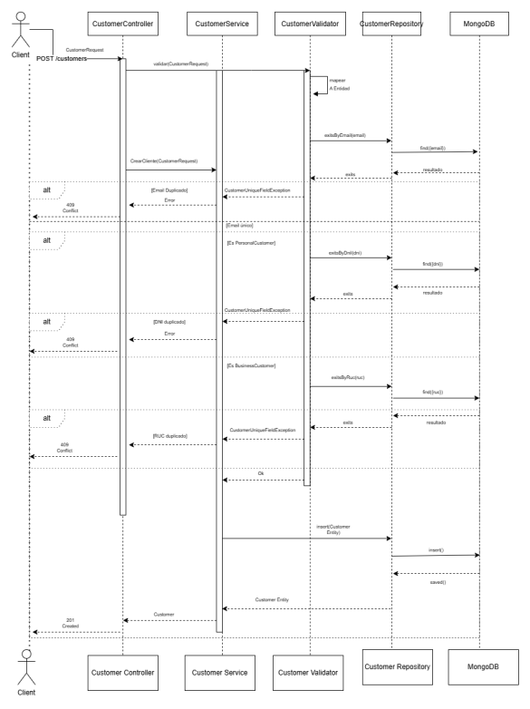

# Customer Microservice

## Description
This microservice is responsible for managing operations related to customers, such as creating, updating, retrieving, and deleting customer records. It also classifies customers into two main types: **Personal** and **Business**, allowing differentiated handling based on the user type.

---

## Customer Types
1. **Personal**
    - Individual customers.
    - Focused on services for physical persons.

2. **Business**
    - Corporate customers.
    - Designed for managing corporate accounts

## Flujograma del microservicio

